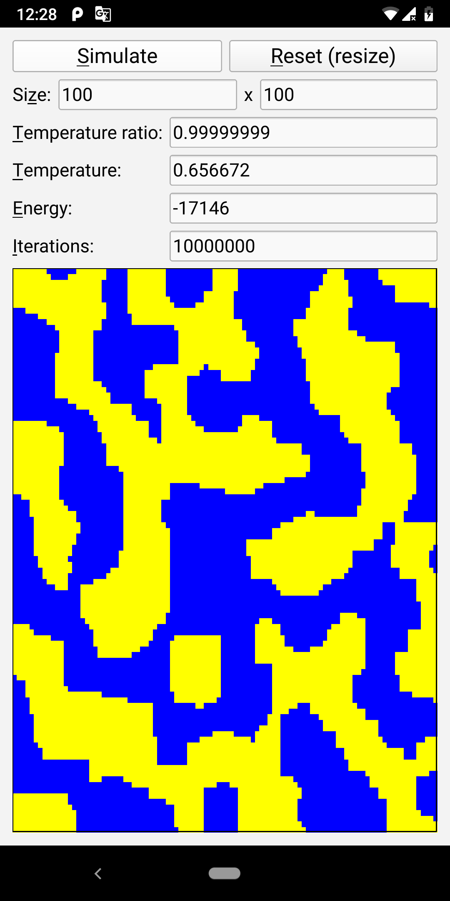

# SimulatedAnnealing
This is a cross-platform application that shows how simulated annealing works on Ising model. It has various settings that allow user to control the simulation. Application is written in C++ using the Qt framework.

